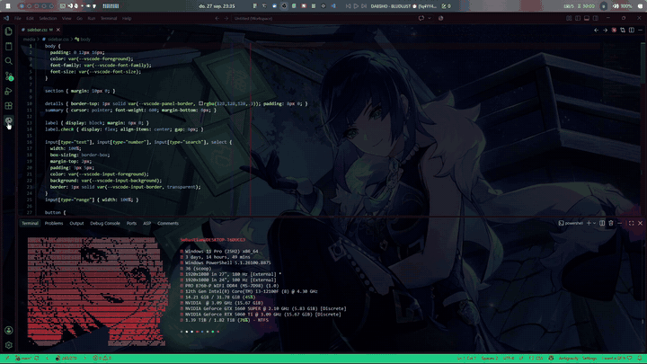
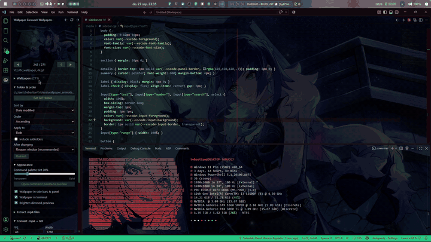

# Wallpaper Carousel for Doki Theme

**An unofficial companion for the [Doki Theme](https://marketplace.visualstudio.com/items?itemName=unthrottled.doki-theme).**
Keep a folder of wallpapers (animated GIFs, PNG, JPG, WebP, AVIF and more) and flip through them with two arrows, choose where the wallpaper shows (editors, side bars, panel, terminal, command palette), darken any wallpaper live with a slider, let VS Code take its colors from the wallpaper, make big GIFs lighter (and find where they loop) and turn your `.mp4` videos into GIF wallpapers, without leaving VS Code.

The animations on this page are encoded at 5 frames per second so they load quickly, which is why they look choppy; the extension itself runs smoothly. Waiting times (Doki installing the image, the window reopening, a conversion running) are also sped up.

> Doki Theme does all the heavy lifting: it draws the wallpaper. This extension only tells Doki *which* image to use and adjusts a few VS Code colors so the wallpaper can show through (or not, where you turn it off), dimmed as much as you like, and, if you want, in matching colors. It contains no Doki Theme code and is not affiliated with the Doki Theme project.

---

## Features

### ◀ ▶ Switch wallpapers in one click

Point the extension at a folder of wallpapers and move through them from:

- the **arrows in the editor title bar**,
- the **status bar** (`◀ 3/42 ▶`, click the counter to pick one from a list),
- the **Wallpaper Carousel panel** in the activity bar,
- the keyboard: `Ctrl+Alt+Shift+←` / `Ctrl+Alt+Shift+→`.

The folder can mix every format Doki can show: **GIF, PNG (also animated APNG), JPG/JPEG/JFIF, WebP (also animated), AVIF (also animated), BMP and ICO**. The panel lists them under the *Set wallpaper folder…* button. SVG and TIFF are left out because VS Code can't display them as a wallpaper.

Above the list, **Filter** narrows it down by name and **Sort by** orders it: by name (numbers sorted naturally, A → Z or Z → A), newest or oldest first (date modified), last or first added (date created), largest or smallest first, or at random (with a *Shuffle again* button). **Refresh list** below them picks up files added or deleted outside VS Code. Subfolders can be included too.

### 🖼️ A panel to browse your collection

- A preview of the current wallpaper and an `n / N` counter. For an animation the preview is a still frame, not the animated file, so the panel stays light even with 100 MB wallpapers.
- A **✕** in the corner of the preview removes the wallpaper from VS Code (also available as the *Remove Wallpaper* command). Unlike Doki's *Remove Sticker/Background*, it keeps Doki's stickers. It is greyed out while no wallpaper is set; applying any wallpaper brings one back.
- A list you can filter and sort: click a name to apply it. The list shows 12 rows and scrolls, so it stays usable with hundreds of wallpapers.
- **w** and **b** buttons in the other corner choose whether the carousel sets Doki's *wallpaper* or its *background*, and turn yellow where an image is set (see [Wallpaper or background?](#-wallpaper-or-background)).
- An **Opacity** slider that darkens the wallpaper live (see [below](#-wallpaper-opacity-live)), and a **Theme from wallpaper** box that colors VS Code after it (see [below](#-theme-from-wallpaper)).
- Short explanations right in the panel, such as what *Wallpaper* and *Background* mean.
- **Instant hover previews**: hovering a name shows a still frame of that wallpaper (the middle frame of an animation). Previews are generated once in the background with ffmpeg and cached, so hovering never has to decode a 100 MB animated GIF. Files ffmpeg can't read (animated WebP) are shown as they are. Dimmed wallpapers (blended with a dark background so code stays readable) are **brightened in the preview only**, so you can still tell them apart; the file itself is never changed.

### 🪟 Wallpaper or background?

Doki has two images, and **Apply as** in the panel's **Folder** section chooses which one the carousel sets. The **w** and **b** buttons in the top left corner of the preview do the same in one click: the chosen one has a grey ring (both with *Both*), and each turns yellow while that image shows a file, so you can tell at a glance what is set where.

| | Where it shows |
| --- | --- |
| **Wallpaper** (`doki.wallpaper.path`) | Through your code, the tabs, the side bars, the panel and the terminal, like a tinted glass pane. This is what most people want. |
| **Background** (`doki.background.path`) | Only the editor area **while no file is open**, behind the VS Code logo. Open a file and it is covered. |
| **Both** | The same image in both places. |

So with a file open, applying an image as *Background* seems to do nothing: close all editors to see it. Doki also has an on/off switch for each image (`doki.wallpaper.enabled`, `doki.background.enabled`); if a switch was off, applying an image turns it on, so what you apply always shows.

### 📏 How large a wallpaper can be

VS Code can load **up to 360 MB of images, wallpaper and background together**. Doki puts both images inside VS Code's stylesheet as text, and JavaScript can't build a text longer than about 512 million characters, which is room for about 384 MB of images; 360 MB leaves a margin for the rest of the stylesheet. The limit is part of VS Code itself, so it is the same on every computer; it doesn't depend on your memory or hardware.

- A 300 MB wallpaper leaves room for a 60 MB background (or none with the background switched off).
- Applied as **Both**, the same image counts twice, so it can be up to 180 MB.
- Doki reads the file of a switched-off image too, so that file must be under 360 MB on its own.

Files that don't fit are marked with ⚠ in the list (the tooltip says why) and skipped by the arrows and *Random*. Clicking one explains the problem and offers to open **GIF optimization** with the file already picked, or to switch off the other image to make room. Well below the limit is better anyway: VS Code reads the whole stylesheet every time a window opens, so a 300 MB GIF makes every window slower to start.

### 🌌 Choose where the wallpaper shows

Recent VS Code versions paint the side bars, the panel and the terminal with solid colors that hide Doki's wallpaper. The extension makes those surfaces transparent so the wallpaper shows through, while keeping text readable:

- left side bar (Explorer, Search, …) and right side bar (chat views),
- bottom panel, including the terminal tabs list,
- the terminal itself, with the text drawn on top of the wallpaper,
- the command palette (`Ctrl+Shift+P`), with an adjustable dark tint (a **0–100 % slider** in the panel).

<!-- TODO: images/everywhere.png (side bars, terminal and command palette over the wallpaper) -->

The **Appearance** section of the panel turns each area on or off:

| Option | When off |
| --- | --- |
| **Wallpaper in editors** | Code, the Welcome page, Settings and tabs get the theme's plain background. The background of the empty editor, if you use one, stays. The window reopens to apply it (see [the one file it changes](#the-one-file-it-changes)). |
| **Wallpaper in side bars & panel** | The side bars and the bottom panel get their theme colors back, right away. |
| **Wallpaper in terminal** | The terminal gets the theme's background color right away; the last thin edge of wallpaper around it goes the next time the window reopens. |

### 🎞️ Turn videos into GIF wallpapers

Both video tools live together in the panel's **.mp4 videos** section.

**Convert .mp4 → GIF**: pick one or many videos and choose:

| Option | What it does |
| --- | --- |
| FPS | Frames per second of the GIF (lower = smaller file) |
| Width / Height | Output size; height `-1` keeps the aspect ratio |
| Start / Duration | Cut a fragment of the video instead of converting all of it |
| Destination | Output folder (empty = next to each video) |

Conversion calls ffmpeg directly (a high-quality two-pass palette), works the same on Windows, macOS and Linux, and shows progress in a notification you can cancel.

Videos whose GIF **already exists** in the destination are skipped, so existing GIFs are never re-rendered or overwritten. Each GIF is rendered in a temporary folder and only moved into place once it is complete, so a cancelled conversion never leaves a half-written GIF behind.

The new GIF shows up in the list right away, ready to apply:

### 🔅 Wallpaper opacity, live

Most wallpapers you download (GIF, PNG, JPG, …) are too bright to read code over. The **Opacity** slider at the top of the panel's *Wallpapers* section darkens whatever wallpaper is shown (100 = as the file is, lower = darker), **while you drag it**: no window reopening, and the files are never changed. It applies to every wallpaper you switch to afterwards.

Doki's wallpaper and its background (the empty editor area) each keep **their own opacity**. The slider sets the one chosen with **w** / **b** on the preview, and says which (*Wallpaper opacity*, *Background opacity*); with *Both* chosen it sets both to the same value.

It works with a thin black layer that the extension's CSS block puts over Doki's wallpaper, under the text (see [the one file it changes](#the-one-file-it-changes)). The block is installed once, and the window reopens to load it the first time; from then on the slider only changes a color. It can only darken: a wallpaper can't get brighter than its file.

### 🎨 Theme from wallpaper

Tick **Theme from wallpaper** at the top of the *Wallpapers* section (it is off by default, and can only be ticked while a wallpaper is set) and VS Code takes its colors from your wallpaper (not from the background, unless you choose it in the settings, see below): a black and red wallpaper gives a theme of near-black surfaces with crimson accents (buttons, badges, the active tab, the cursor, selections, links, the status bar). It follows the wallpaper: switch to another one and the colors change with it, without reopening the window.

- **How the palette is found**: a few frames of the wallpaper (one for a still image) are read small with ffmpeg and their colors grouped into the six main ones. Darkened wallpapers are brightened first, so their real hues come out. The main color tints the surfaces, the most colorful one that covers a fair part of the picture becomes the accent, and another hue the secondary color.
- **Always readable**: the theme is always dark, since code sits on the wallpaper, and every text color is checked for contrast (WCAG) and made lighter until it reads well.
- **It replaces your theme**: turning it on asks first, then switches VS Code to its own dark theme and lays the palette over it, so Doki's colors don't mix in. Doki's wallpapers and stickers stay. Don't pick a Doki theme while it is on (the extension offers to turn it off if you do).
- **Turning it off**: untick the box, or remove the wallpaper: without one there is no palette. VS Code keeps its own theme without the palette's colors; pick a Doki theme again in *Preferences: Color Theme* if you want one.
- Colors you set yourself in `workbench.colorCustomizations` are never replaced.
- **From the background instead**: the palette comes from the *wallpaper* by default. To take it from the *background* (the empty editor's image), set `dokiCarousel.paletteSource` to `background` in the extension's settings.

### 🪶 Make GIFs lighter

Big GIFs make Doki and VS Code slower to load. **GIF optimization** re-encodes GIFs you already have with the same high-quality two-pass palette as the video conversion:

| Option | What it does |
| --- | --- |
| Files | The GIFs to optimize (click *…*, pick one or many) |
| FPS | Frames per second; fewer frames = a smaller file. `0` keeps the GIF's own |
| Width / Height | New size; `0` keeps the width, height `-1` keeps the aspect ratio |
| Start / Duration | Keep only a fragment; duration `0` = up to the end |
| Destination folder | Where the optimized GIFs go. Empty, or the GIFs' own folder, replaces them (after asking) |

For example, 10 FPS at 320 px wide turned a 1.3 MB test GIF into 290 KB. Each GIF is rendered aside and only written once it is complete, so a failure or a cancel leaves the file as it was, and **if your current wallpaper is replaced, it is loaded again automatically**.

**Find the loops.** A wallpaper plays over and over, so many GIFs hold the same animation several times, or end with a few frames that repeat the start and make it stutter. With **one** GIF picked, the extension reads it (a few seconds, even for a 270 MB GIF) and a **Loops** track appears under *Start* and *Duration*: each yellow dot is where the animation is back at its first frame, so the loop that began at the previous dot (or at the start) ends there. Click a dot to fill *Start* and *Duration* with just that loop; the track shades the part that will be kept.

Frames rarely come back exactly the same (a particle, a flicker), so the **Match** slider sets how alike they must be: 97 % means 97 % of the moving parts of the picture are back where they started. The still background doesn't count, or every frame would match. Lower it to find looser loops, raise it for exact ones.

### 📦 Collect scattered videos into one folder

**Extract .mp4 files** finds every `.mp4` inside a folder and all its subfolders and copies (or moves) them into a single folder, ready to convert.

It never duplicates anything:

- a video that is **already in the destination** (under any name) is skipped;
- the same video found in **two source folders** is copied only once;
- two **different** videos with the same name are both kept (`name (1).mp4`);
- when moving, a skipped duplicate is **left where it was**, never deleted.

Duplicates are detected by content (file size plus samples from the start, middle and end of the file), so it stays fast even with multi-GB videos. A summary shows how many files were copied, skipped or failed, with per-file details in the output channel.

---

## Requirements

- **VS Code 1.85** or newer.
- **[Doki Theme](https://marketplace.visualstudio.com/items?itemName=unthrottled.doki-theme)**, installed automatically as a dependency, with a Doki theme active and its wallpaper enabled (`doki.wallpaper.enabled`).
- **[ffmpeg](https://ffmpeg.org/download.html)** (with `ffprobe`), for hover previews, video conversion, GIF optimization and its loops, and Theme from wallpaper. Everything else works without it.

  | OS | Install |
  | --- | --- |
  | Windows | `winget install Gyan.FFmpeg` or `scoop install ffmpeg` |
  | macOS | `brew install ffmpeg` |
  | Linux | `sudo apt install ffmpeg`, `sudo dnf install ffmpeg`, `sudo pacman -S ffmpeg`, … |

  The extension finds ffmpeg on your `PATH` and in the usual install folders (Homebrew, winget, scoop, `/usr/bin`, …), even when VS Code was started from the Dock or a desktop launcher. Otherwise set `dokiCarousel.ffmpegPath`.

Works on **Windows, macOS and Linux**. Doki Theme must be able to write to VS Code's installation folder to install wallpapers. On some Linux installs (system packages, Snap, Flatpak) this needs extra steps; see the Doki Theme documentation.

## Getting started

1. Install the extension (Doki Theme comes with it) and pick a Doki theme.
2. Open the **Wallpaper Carousel** view in the activity bar.
3. Click **Set wallpaper folder…** and choose your wallpapers folder.
4. Use the arrows ◀ ▶, or click any wallpaper in the list.

> **Tip:** wallpapers look good *behind code* when they are dark. Try the **Opacity** slider at 25–40 %.

## How switching works (and why the window reopens)

1. The extension writes the new path to Doki's `doki.wallpaper.path` setting (or `doki.background.path`, see [Wallpaper or background?](#-wallpaper-or-background)).
2. Doki notices the change and installs the new wallpaper into VS Code's stylesheet.
3. The extension waits until the stylesheet really contains the new image, then **opens your workspace in a new, maximized window and closes the old one**.

While this happens, a progress bar appears where the command palette opens, with the current step and an estimate of the time left (it learns how long Doki takes on your machine). Only one wallpaper can be applied at a time: extra clicks, arrows or shortcuts are ignored until the window reopens, so clicking a wallpaper ten times never opens ten windows. If for some reason the window does not close, the carousel unlocks again after a few seconds.

Switching is also paused while `.mp4` files are being copied, moved or converted to GIF, or GIFs are being optimized, in that window, because reopening the window would stop them halfway. The panel shows what is running, and you can switch again as soon as it finishes. Likewise, a copy or conversion can't be started while a wallpaper is being applied.

A plain *Reload Window* is not enough: installed VS Code caches its stylesheet per window, so a reload keeps showing the previous wallpaper. A fresh window reads the new one, which is why the extension always reopens the window.

If your workspace defines its own `doki.wallpaper.path`, the extension updates it there, because a workspace value overrides the user one.

## Commands

| Command | Default key |
| --- | --- |
| Wallpaper Carousel: Next Wallpaper | `Ctrl+Alt+Shift+→` |
| Wallpaper Carousel: Previous Wallpaper | `Ctrl+Alt+Shift+←` |
| Wallpaper Carousel: Random Wallpaper | |
| Wallpaper Carousel: Pick Wallpaper... | |
| Wallpaper Carousel: Remove Wallpaper | |
| Wallpaper Carousel: Set Wallpaper Folder... | |
| Wallpaper Carousel: Extract .mp4 Files From Folder Tree... | |
| Wallpaper Carousel: Convert .mp4 to GIF... | |
| Wallpaper Carousel: Optimize GIFs... | |

## Settings

| Setting | Default | Description |
| --- | --- | --- |
| `dokiCarousel.folder` | `""` | Folder with your wallpapers. |
| `dokiCarousel.includeSubfolders` | `false` | Also include images in subfolders. |
| `dokiCarousel.extensions` | every format Doki can show | File types included in the carousel: `.gif .png .apng .jpg .jpeg .jfif .webp .avif .bmp .ico`. Remove the ones you don't want, e.g. `[".gif"]` for GIFs only. |
| `dokiCarousel.sortBy` | `name` | `name`, `modified`, `created`, `size` or `random`. The panel's *Sort by* list sets this and `sortOrder` together. |
| `dokiCarousel.sortOrder` | `asc` | `asc` (A → Z, oldest or smallest first) or `desc`. |
| `dokiCarousel.target` | `wallpaper` | Which of Doki's images to change: `wallpaper`, `background` (empty editor) or `both`. See [Wallpaper or background?](#-wallpaper-or-background). |
| `dokiCarousel.maximize` | `true` | Open the refreshed window maximized. |
| `dokiCarousel.wallpaperInEditor` | `true` | Show the wallpaper in the editor area (code, Welcome page, Settings, tabs). Changing it reopens the window. |
| `dokiCarousel.transparentPanels` | `true` | Show the wallpaper behind both side bars and the bottom panel. |
| `dokiCarousel.transparentTerminal` | `true` | Show the wallpaper behind the terminal text. When off, the terminal gets the theme's background color. |
| `dokiCarousel.fixTerminalText` | `true` | Keep terminal text visible over the wallpaper (see below). |
| `dokiCarousel.wallpaperTheme` | `false` | Theme from wallpaper: VS Code's colors from the wallpaper's palette. |
| `dokiCarousel.paletteSource` | `wallpaper` | Which image gives its palette to Theme from wallpaper: `wallpaper` or `background`. |
| `dokiCarousel.wallpaperOpacity` | `100` | Opacity (0–100 %) of Doki's wallpaper over black, changed live. |
| `dokiCarousel.backgroundOpacity` | `100` | Opacity (0–100 %) of Doki's background (empty editor) over black, changed live. |
| `dokiCarousel.quickInputTint` | `65` | Darkness (0–100 %) behind the command palette. |
| `dokiCarousel.brightenThumbnails` | `true` | Brighten the hover previews of dimmed wallpapers so they are easy to recognize. Only the previews change. |
| `dokiCarousel.showEditorTitleArrows` | `true` | Show ◀ ▶ in the editor title bar. |
| `dokiCarousel.showStatusBar` | `true` | Show ◀ n/N ▶ in the status bar. |
| `dokiCarousel.ffmpegPath` | `""` | Folder containing ffmpeg and ffprobe, if they aren't found automatically. |
| `dokiCarousel.converterScript` | `""` | Optional PowerShell converter of your own (parameters `-Path`, `-Fps`, `-Width`, …). Runs with `powershell.exe` on Windows and `pwsh` on macOS/Linux. Empty = built-in ffmpeg converter. |

## What this extension changes in your settings

Transparency is done with regular VS Code settings:

| Setting | Value | Why |
| --- | --- | --- |
| `doki.wallpaper.path` / `doki.background.path` | the selected image | Tells Doki which wallpaper to install. Cleared by the ✕ (*Remove Wallpaper*). |
| `doki.wallpaper.enabled` / `doki.background.enabled` | `true` when you apply an image, `false` when you remove it | Doki's own switch for each image. Turning it off and clearing the path makes Doki take the image out of VS Code while keeping its stickers. |
| `workbench.colorCustomizations` → `sideBar.background`, `sideBarSectionHeader.background`, `panel.background` | `#00000000` | Shows the wallpaper behind the side bars and panel. |
| `workbench.colorCustomizations` → `terminal.background` | `#00000000`, or the theme's own background color when *Wallpaper in terminal* is off | Shows the wallpaper behind the terminal, or covers it. Themes rarely set a terminal color, and VS Code then uses the panel's, which is transparent while the panel shows the wallpaper. A terminal color you set yourself is kept. |
| `workbench.colorCustomizations` → `quickInput.background` | black at the chosen tint | Command palette tint. |
| `workbench.colorCustomizations` → 78 theme colors (`focusBorder`, `button.background`, `statusBar.background`, …) | from the wallpaper's palette | Only with **Theme from wallpaper** on. The colors you had set yourself when you turned it on are kept; the others are removed when it is turned off or no wallpaper is set. |
| `workbench.colorTheme` | VS Code's own dark theme | Only when you turn **Theme from wallpaper** on, after asking. Not changed back when it is turned off. |
| `workbench.colorCustomizations` → `dokiCarousel.wallpaperDim`, `dokiCarousel.backgroundDim` | black at 100 % minus the chosen opacity | The **Opacity** slider, for the wallpaper and the background (each only below 100 %, and while Doki's switch for that image is on). |
| `terminal.integrated.gpuAcceleration` | `off` | Doki's wallpaper covers the text drawn by the GPU terminal renderer; the standard renderer keeps it visible. |
| `window.newWindowDimensions` | `maximized` (for a moment) | Opens the refreshed window maximized, then restores your value. |

When a value is no longer needed, the extension removes it, and only values it added itself. Colors you set yourself are never touched.

### The one file it changes

Doki draws the wallpaper right on the editor and terminal elements, so no color setting can dim or hide it there. So the extension adds a small, clearly marked block of CSS (`/* Wallpaper Carousel for Doki Theme: start */ … end */`) to the same VS Code stylesheet Doki writes the wallpaper into, placed where Doki keeps it when it installs a new wallpaper. The block puts the black layer of the **Opacity** slider over the wallpaper; its colors come from `workbench.colorCustomizations` → `dokiCarousel.wallpaperDim` and `dokiCarousel.backgroundDim`, which is why the slider works without reopening the window. When you turn off **Wallpaper in editors** or **Wallpaper in terminal**, the block also hides the wallpaper there. Like Doki, it updates the file's checksum in VS Code's `product.json` (after saving a copy of the original as `product.json.orig.<version>`, unless Doki already did).

The block is removed when the extension is uninstalled. A VS Code update replaces the stylesheet; the extension then adds the block back and offers to reopen the window.

## Troubleshooting

**"Doki did not update the CSS yet"**: make sure a Doki theme is active and `doki.wallpaper.enabled` is `true`. Doki may check its online assets before installing, which can take a few seconds on a slow network.

**Doki opens its "Asset Installation Help" page asking for write access or to run as administrator**: Doki shows that page whenever installing an image fails, for any reason. If it happens with a big wallpaper set outside this extension (in Doki's settings, for example), the real reason is its size: see [how large a wallpaper can be](#-how-large-a-wallpaper-can-be). *Help > Toggle Developer Tools* then shows `Unable to install sticker! RangeError: Invalid string length`. The extension checks the size before handing a file to Doki, so this doesn't happen when you apply wallpapers from the carousel.

**The wallpaper did not change after switching**: restart VS Code. If you applied it as *Background*, close all editors: the background only shows while no file is open.

**A wallpaper changed outside the extension still looks the same**: Doki keeps showing the version it installed. Click the wallpaper in the list to install it again. (Files replaced by *GIF optimization* are reloaded automatically.)

**VS Code says the installation is "[Unsupported]" or corrupt**: that message comes from VS Code's stylesheet being changed, by Doki when it installs a wallpaper and by this extension's CSS block (see [the one file it changes](#the-one-file-it-changes)). Both fix the checksum right away, but VS Code keeps comparing against the one it read when it started, so the notice can show up until VS Code is fully restarted. It is harmless; choose *Don't Show Again* to hide it. See the Doki Theme documentation.

**Terminal text is invisible**: keep `dokiCarousel.fixTerminalText` enabled, then open a new terminal.

**No hover previews or loops / conversion or GIF optimization fails**: check that `ffmpeg -version` and `ffprobe -version` work in a new terminal, or point `dokiCarousel.ffmpegPath` at the folder that contains them. The **Wallpaper Carousel** output channel shows ffmpeg's messages.

**The Opacity slider does nothing**: the window has to reopen once to load the CSS it needs. Accept the *Reopen* notification that shows a few seconds after the extension is installed or updated, or after a VS Code update.

**Theme from wallpaper shows no colors**: it needs a wallpaper (or, with `dokiCarousel.paletteSource` set to `background`, a background) applied and ffmpeg installed. A Doki theme picked afterwards mixes its colors with the palette: turn the option off to use the Doki theme alone.

**Removing everything**: when you uninstall the extension, it takes out the colors it added to `workbench.colorCustomizations` (yours stay) and asks whether to **uninstall Doki Theme too**: Doki came along as a dependency, but it also gives VS Code its themes and stickers, so the choice is yours. The extension's CSS block leaves VS Code's stylesheet the next time VS Code starts. Delete `terminal.integrated.gpuAcceleration` from your settings if you want the GPU terminal back. Click the **✕** on the preview first if you want the wallpaper gone but keep Doki (Doki's *Remove Sticker/Background* removes it together with the stickers).

## Privacy

The extension makes no network requests and collects no data. Hover previews and wallpaper palettes are stored in the extension's private storage on your machine.

## Credits

- Wallpapers are drawn by the [Doki Theme](https://github.com/doki-theme/doki-theme-vscode) by Unthrottled (MIT). This is an independent companion extension, not affiliated with or endorsed by the Doki Theme project.
- Video conversion is powered by [ffmpeg](https://ffmpeg.org/), which you install separately.

Only use images and videos you have the right to use.

## License

[MIT](LICENSE)
