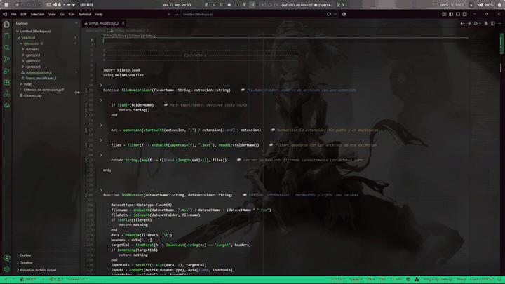
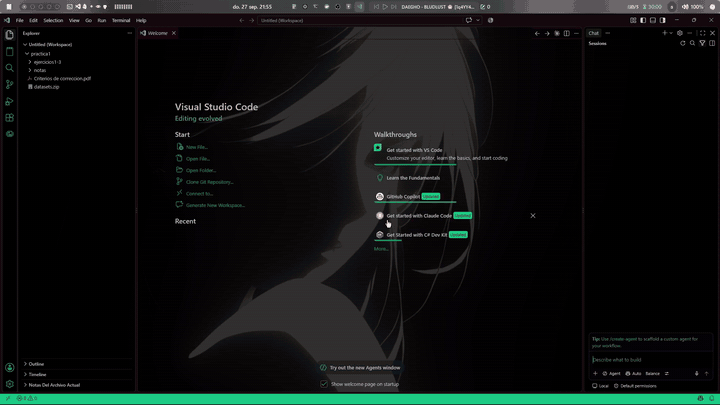
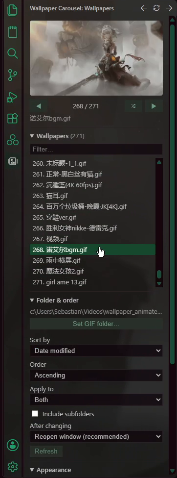

# Wallpaper Carousel for Doki Theme

**An unofficial companion for the [Doki Theme](https://marketplace.visualstudio.com/items?itemName=unthrottled.doki-theme).**
Keep a folder of animated GIF wallpapers and flip through them with two arrows, see the wallpaper behind your side bars, panel, terminal and command palette, and turn your `.mp4` videos into GIF wallpapers without leaving VS Code.

Waiting times (Doki installing the image and the window reopening) are sped up in the animations.

> Doki Theme does all the heavy lifting: it draws the wallpaper. This extension only tells Doki *which* image to use and adjusts a few VS Code colors so the wallpaper can show through. It contains no Doki Theme code and is not affiliated with the Doki Theme project.

---

## Features

### ◀ ▶ Switch wallpapers in one click

Point the extension at a folder of GIFs (or PNG/JPG/WebP) and move through them from:

- the **arrows in the editor title bar**,
- the **status bar** (`◀ 3/42 ▶`, click the counter to pick one from a list),
- the **Wallpaper Carousel panel** in the activity bar,
- the keyboard: `Ctrl+Alt+Shift+←` / `Ctrl+Alt+Shift+→`.

Sort the folder by **name** (numbers sorted naturally), **date modified**, **date created**, **size** or **random** (with a *Reshuffle* button), ascending or descending, with or without subfolders.

### 🖼️ A panel to browse your collection

- Preview of the current wallpaper and an `n / N` counter.
- A filterable list: click a name to apply it. The list shows 12 rows and scrolls, so it stays usable with hundreds of wallpapers.
- **Instant hover previews**: hovering a name shows a still frame from the middle of that GIF. Previews are generated once in the background with ffmpeg and cached, so hovering never has to decode a 100 MB animated GIF. Dimmed wallpapers (GIFs blended with a dark background so code stays readable) are **brightened in the preview only**, so you can still tell them apart; the GIF itself is never changed.

### 🌌 The wallpaper everywhere, not just in the editor

Recent VS Code versions paint the side bars, the panel and the terminal with solid colors that hide Doki's wallpaper. The extension makes those surfaces transparent so the wallpaper shows through, while keeping text readable:

- left side bar (Explorer, Search, …) and right side bar (chat views),
- bottom panel, including the terminal tabs list,
- the terminal itself, with the text drawn on top of the wallpaper,
- the command palette (`Ctrl+Shift+P`), with an adjustable dark tint (a **0–100 % slider** in the panel).

<!-- TODO: images/everywhere.png (side bars, terminal and command palette over the wallpaper) -->

Each of these can be switched off in the **Appearance** section of the panel.

### 🎞️ Turn videos into GIF wallpapers

**Convert .mp4 → GIF**: pick one or many videos and choose:

| Option | What it does |
| --- | --- |
| FPS | Frames per second of the GIF (lower = smaller file) |
| Width / Height | Output size; height `-1` keeps the aspect ratio |
| Video opacity | How visible the video is over black: 25 = a dark, faint video, 100 = unchanged. Keeps wallpapers dark enough to read code on |
| Start / Duration | Cut a fragment of the video instead of converting all of it |
| Destination | Output folder (empty = next to each video) |

Conversion calls ffmpeg directly (a high-quality two-pass palette), works the same on Windows, macOS and Linux, and shows progress in a notification you can cancel.

Videos whose GIF **already exists** in the destination are skipped, so existing GIFs are never re-rendered or overwritten. Each GIF is rendered in a temporary folder and only moved into place once it is complete, so a cancelled conversion never leaves a half-written GIF behind.

<!-- TODO: images/convert.gif -->

### 📦 Collect scattered videos into one folder

**Extract .mp4 files** finds every `.mp4` inside a folder and all its subfolders and copies (or moves) them into a single folder, ready to convert.

It never duplicates anything:

- a video that is **already in the destination** (under any name) is skipped;
- the same video found in **two source folders** is copied only once;
- two **different** videos with the same name are both kept (`name (1).mp4`);
- when moving, a skipped duplicate is **left where it was**, never deleted.

Duplicates are detected by content (file size plus samples from the start, middle and end of the file), so it stays fast even with multi-GB videos. A summary shows how many files were copied, skipped or failed, with per-file details in the output channel.

---

## Requirements

- **VS Code 1.85** or newer.
- **[Doki Theme](https://marketplace.visualstudio.com/items?itemName=unthrottled.doki-theme)**, installed automatically as a dependency, with a Doki theme active and its wallpaper enabled (`doki.wallpaper.enabled`).
- **[ffmpeg](https://ffmpeg.org/download.html)** (with `ffprobe`), for hover previews and video conversion. Everything else works without it.

  | OS | Install |
  | --- | --- |
  | Windows | `winget install Gyan.FFmpeg` or `scoop install ffmpeg` |
  | macOS | `brew install ffmpeg` |
  | Linux | `sudo apt install ffmpeg`, `sudo dnf install ffmpeg`, `sudo pacman -S ffmpeg`, … |

  The extension finds ffmpeg on your `PATH` and in the usual install folders (Homebrew, winget, scoop, `/usr/bin`, …), even when VS Code was started from the Dock or a desktop launcher. Otherwise set `dokiCarousel.ffmpegPath`.

Works on **Windows, macOS and Linux**. Doki Theme must be able to write to VS Code's installation folder to install wallpapers. On some Linux installs (system packages, Snap, Flatpak) this needs extra steps; see the Doki Theme documentation.

## Getting started

1. Install the extension (Doki Theme comes with it) and pick a Doki theme.
2. Open the **Wallpaper Carousel** view in the activity bar.
3. Click **Set GIF folder…** and choose your wallpapers folder.
4. Use the arrows ◀ ▶, or click any wallpaper in the list.

> **Tip:** wallpapers that look good *behind code* are dark or dimmed. When converting, try **Video opacity 25–40**.

## How switching works (and why the window reopens)

1. The extension writes the new path to Doki's `doki.wallpaper.path` setting (or `doki.background.path`, see `dokiCarousel.target`).
2. Doki notices the change and installs the new wallpaper into VS Code's stylesheet.
3. The extension waits until the stylesheet really contains the new image, then **opens your workspace in a new, maximized window and closes the old one**.

While this happens, a progress bar appears where the command palette opens, with the current step and an estimate of the time left (it learns how long Doki takes on your machine). Only one wallpaper can be applied at a time: extra clicks, arrows or shortcuts are ignored until the window reopens, so clicking a wallpaper ten times never opens ten windows. If for some reason the window does not close, the carousel unlocks again after a few seconds.

Switching is also paused while `.mp4` files are being copied, moved or converted to GIF in that window, because reopening the window would stop them halfway. The panel shows what is running, and you can switch again as soon as it finishes. Likewise, a copy or conversion can't be started while a wallpaper is being applied.

A plain *Reload Window* is not enough: installed VS Code caches its stylesheet per window, so a reload keeps showing the previous wallpaper. A fresh window reads the new one. You can change this with `dokiCarousel.reloadMode`.

If your workspace defines its own `doki.wallpaper.path`, the extension updates it there, because a workspace value overrides the user one.

## Commands

| Command | Default key |
| --- | --- |
| Wallpaper Carousel: Next Wallpaper | `Ctrl+Alt+Shift+→` |
| Wallpaper Carousel: Previous Wallpaper | `Ctrl+Alt+Shift+←` |
| Wallpaper Carousel: Random Wallpaper | |
| Wallpaper Carousel: Pick Wallpaper... | |
| Wallpaper Carousel: Set Wallpaper Folder... | |
| Wallpaper Carousel: Extract .mp4 Files From Folder Tree... | |
| Wallpaper Carousel: Convert .mp4 to GIF... | |

## Settings

| Setting | Default | Description |
| --- | --- | --- |
| `dokiCarousel.folder` | `""` | Folder with your wallpapers. |
| `dokiCarousel.includeSubfolders` | `false` | Also include images in subfolders. |
| `dokiCarousel.extensions` | `[".gif"]` | File types included in the carousel, e.g. `[".gif", ".png", ".webp"]`. |
| `dokiCarousel.sortBy` | `name` | `name`, `modified`, `created`, `size` or `random`. |
| `dokiCarousel.sortOrder` | `asc` | `asc` or `desc`. |
| `dokiCarousel.target` | `wallpaper` | Which Doki setting to change: `wallpaper`, `background` (empty editor) or `both`. |
| `dokiCarousel.reloadMode` | `newWindow` | After switching: `newWindow` (reliable), `reload` (faster but usually shows the cached wallpaper) or `none`. |
| `dokiCarousel.maximize` | `true` | Open the refreshed window maximized. |
| `dokiCarousel.transparentPanels` | `true` | Show the wallpaper behind both side bars and the bottom panel. |
| `dokiCarousel.transparentTerminal` | `true` | Show the wallpaper behind the terminal text. |
| `dokiCarousel.fixTerminalText` | `true` | Keep terminal text visible over the wallpaper (see below). |
| `dokiCarousel.quickInputTint` | `65` | Darkness (0–100 %) behind the command palette. |
| `dokiCarousel.brightenThumbnails` | `true` | Brighten the hover previews of dimmed wallpapers so they are easy to recognize. Only the previews change. |
| `dokiCarousel.showEditorTitleArrows` | `true` | Show ◀ ▶ in the editor title bar. |
| `dokiCarousel.showStatusBar` | `true` | Show ◀ n/N ▶ in the status bar. |
| `dokiCarousel.ffmpegPath` | `""` | Folder containing ffmpeg and ffprobe, if they aren't found automatically. |
| `dokiCarousel.converterScript` | `""` | Optional PowerShell converter of your own (parameters `-Path`, `-Fps`, `-Width`, …). Runs with `powershell.exe` on Windows and `pwsh` on macOS/Linux. Empty = built-in ffmpeg converter. |

## What this extension changes in your settings

Transparency is done with regular VS Code settings, not by patching files:

| Setting | Value | Why |
| --- | --- | --- |
| `doki.wallpaper.path` / `doki.background.path` | the selected image | Tells Doki which wallpaper to install. |
| `workbench.colorCustomizations` → `sideBar.background`, `sideBarSectionHeader.background`, `panel.background` | `#00000000` | Shows the wallpaper behind the side bars and panel. |
| `workbench.colorCustomizations` → `terminal.background` | `#00000000` | Shows the wallpaper behind the terminal. |
| `workbench.colorCustomizations` → `quickInput.background` | black at the chosen tint | Command palette tint. |
| `terminal.integrated.gpuAcceleration` | `off` | Doki's wallpaper covers the text drawn by the GPU terminal renderer; the standard renderer keeps it visible. |
| `window.newWindowDimensions` | `maximized` (for a moment) | Opens the refreshed window maximized, then restores your value. |

Turning a feature off removes only the values the extension added. Colors you set yourself are never touched.

## Troubleshooting

**"Doki did not update the CSS yet"**: make sure a Doki theme is active and `doki.wallpaper.enabled` is `true`. Doki may check its online assets before installing, which can take a few seconds on a slow network.

**The wallpaper did not change after switching**: set `dokiCarousel.reloadMode` to `newWindow` (the default). Restarting VS Code also works.

**VS Code says the installation is "[Unsupported]" or corrupt**: that message comes from Doki Theme modifying VS Code's files, and Doki repairs it automatically. See the Doki Theme documentation.

**Terminal text is invisible**: keep `dokiCarousel.fixTerminalText` enabled, then open a new terminal.

**No hover previews / conversion fails**: check that `ffmpeg -version` and `ffprobe -version` work in a new terminal, or point `dokiCarousel.ffmpegPath` at the folder that contains them. The **Wallpaper Carousel** output channel shows ffmpeg's messages.

**Removing everything**: uninstalling does not revert the settings listed above. Before uninstalling, untick the options in the panel's **Appearance** section so the extension removes its transparent colors. Then delete `quickInput.background` from `workbench.colorCustomizations`, and `terminal.integrated.gpuAcceleration` if you want the GPU terminal back. Run **Doki-Theme: Remove Sticker/Background** if you also want Doki's wallpaper gone.

## Privacy

The extension makes no network requests and collects no data. Hover previews are stored in the extension's private storage folder on your machine.

## Credits

- Wallpapers are drawn by the [Doki Theme](https://github.com/doki-theme/doki-theme-vscode) by Unthrottled (MIT). This is an independent companion extension, not affiliated with or endorsed by the Doki Theme project.
- Video conversion is powered by [ffmpeg](https://ffmpeg.org/), which you install separately.

Only use images and videos you have the right to use.

## License

[MIT](LICENSE)
